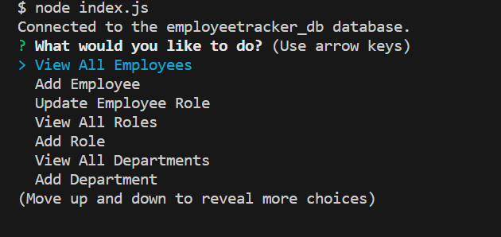
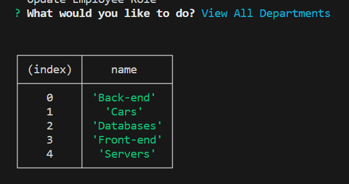
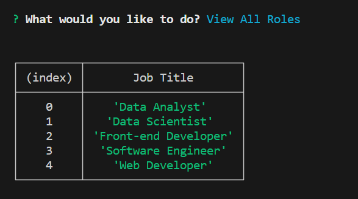
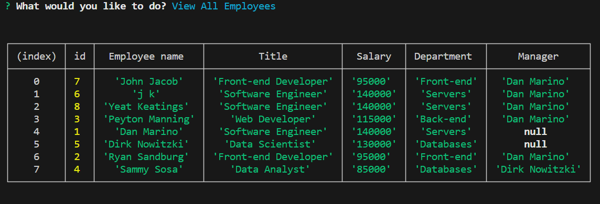

# musical-kerfluffle (Employee Tracker)  
    
## Description

This project was built to add in conducting HR type tasks such as adding employees to the database, tracking salaries, tracking dept costs and the like. This will help businesses better handle and track their personnel.
  
## Table of Contents 

■ [Installation](#installation)   ■ [Usage](#usage)   ■ [How to Contribute](#how-to-contribute)   ■ [Testing](#testing)   ■ [Questions](#questions)   ■ [License](#license)  

## Installation

In order to install this app, one would need to download the c code from  github and then  type "node index.js" into the terminal. The app will trun from there.

## Usage 

In order to use the site one must select one of the opening options and then follow the prompts. If one was to select the view all departments, the view all roles option or the view all employees options a table will generate:

 
If one was to select 'add to' for any of the tables, a prompt will guide the user to select the options to update and then the app will notify the user upon the data being updated.

## How to Contribute 

Anyone who would like to contribute to the project should reach out via email or  via linkedin.>

## Testing 

This project was extensively tested by the developer.

## Questions 

Direct questions to the following:

Github: https://github.com/DustinSwecker

Email: dustin.swecker@gmail.com
  
## License

https://opensource.org/licenses/MIT

This project uses an MIT License
